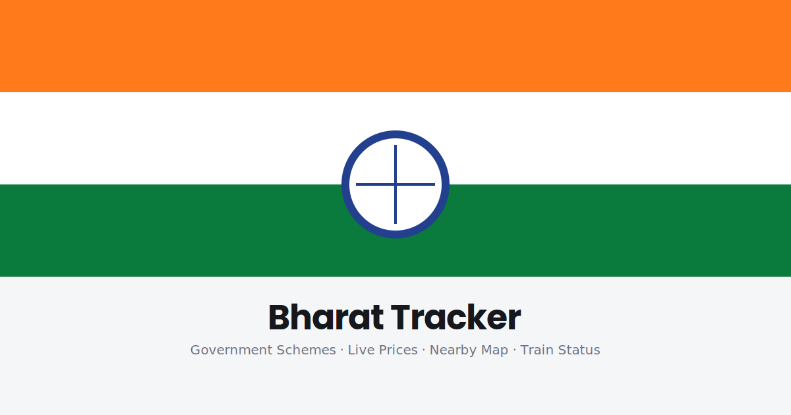

<p align="center">
  
</p>

<p align="center">
  
  
  
  
</p>

# Bharat Tracker

A single-page site tracking things useful for everyday life in India: government schemes, live gold/silver prices, a nearby-places map, and train status lookup.

**[View it live](https://gagananair.github.io/bharat-tracker/)**

## What's in it

### Government Schemes
A searchable, filterable directory of 15 major central government schemes (PM-KISAN, Ayushman Bharat, PMAY, Ujjwala Yojana, Mudra loans, and more) — who's eligible, what the benefit is, and how to apply, each linking to the official page.

### Live Prices
Real-time gold and silver spot prices, converted to INR:
- **Data source:** [gold-api.com](https://gold-api.com) — genuinely free, no API key required, CORS-enabled
- **Currency conversion:** [open.er-api.com](https://www.exchangerate-api.com) — free, no key required
- Auto-refreshes every 60 seconds

Fuel prices are **not** included as live data, because no free, keyless public API for Indian fuel prices exists — every source (government or third-party) requires registration. The page has a spot to paste your own free [data.gov.in](https://data.gov.in) API key if you want to wire this up further.

### Train Status
No reliable free public API exists for Indian Railways PNR/running status either — the ones that exist are paid or require registered keys, and unofficial scrapers are unreliable and can break without notice. Rather than show fake or unverified data, this section validates your PNR/train number format and takes you straight to the **official government lookup tools** with a clean, no-nonsense flow.

### Nearby Map
Shows fuel stations, hospitals, or railway stations within **20km** of your location, plotted on a real map, sorted nearest-first:
- **Map tiles:** OpenStreetMap — free, no API key
- **Place data:** [Overpass API](https://overpass-api.de) — free, no API key, queried live from your browser
- Your location comes from the browser's own Geolocation API (with your permission) and is only sent to Overpass to run the nearby search — never stored or sent anywhere else
- Falls back through 3 different Overpass mirror servers if the main one is briefly overloaded, and includes a short cooldown between filter switches to stay within Overpass's rate limits

## Why some things link out instead of showing live data in-app

Being upfront about data sources matters more than looking "complete." Fuel prices and train status genuinely require paid or registered APIs to get real, reliable answers — so rather than fabricate numbers or scrape something fragile, this project links to the authoritative source for those two, and keeps live in-app data to the two things (schemes, gold/silver prices) that can be done honestly with free, public data.

## Running it

Just open `index.html` in any browser — no build step, no dependencies.

```bash
git clone https://github.com/GAGANANAIR/bharat-tracker.git
cd bharat-tracker
open index.html
```

## Contributing

To add or correct a scheme, edit the `SCHEMES` array in `schemes.js` — each entry needs `name`, `category`, `who`, `benefit`, `how`, and `link`.

## Author

**Gagan A Nair**
- [Website](https://gagagananair.netlify.app/)
